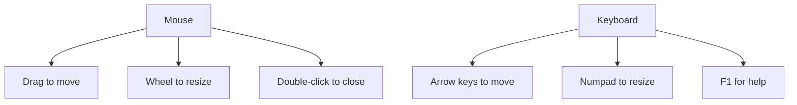

# 🖥️ BlackoutBuddy

## 🎭 Why hide when you can blackout?

Ever felt like you're starring in your own reality show during video calls? 📹 Tired of being distracted by your own charming face or those pesky ads while trying to focus? Say hello to BlackoutBuddy, your new best friend in the digital world!

## 🌟 Features

- 🎨 Creates a sleek black rectangle to cover anything on your screen
- 🖱️ Drag and drop for easy positioning
- 🔍 Semi-transparent when hovered for sneaky peeking
- ⌨️ Pixel-perfect positioning with arrow keys
- 🔢 Resize with numpad for that perfect fit
- 🖲️ Mouse wheel resizing for the scroll enthusiasts
- 🆘 Help at your fingertips with F1

## 🤩 Showcase
### In Microsoft Teams


### In Zoom


## 🚀 Getting Started

### Prerequisites

- A Windows environment with .NET installed
- A burning desire to hide things on your screen 😉

### Installation

1. Clone the repo
   ```
   git clone https://github.com/PatBQc/BlackoutBuddy.git
   ```
2. Compile the solution
   
   OR
   
1. Download the latest release from the GitHub "Releases" page

## 🎮 How to Use

1. Launch BlackoutBuddy
2. Position the black rectangle over what you want to hide
3. Enjoy your distraction-free view!

### 🕹️ Controls



## 💡 Pro Tips

- 🎥 Perfect for hiding your camera feed in Microsoft Teams, Zoom, or Google Meet
- 🚫 Great for blocking annoying ads or animations on web pages
- 🧘 Enhance your focus during video calls (as recommended by Andrew Huberman!)

## 🤝 Contributing

Pull requests are welcome. For major changes, please open an issue first to discuss what you would like to change.

## 📜 License

This project is licensed under the MIT License - see the [LICENSE.md](https://github.com/PatBQc/BlackoutBuddy/blob/master/LICENSE) file for details.

## 🙏 Acknowledgments

- Thanks to Andrew Huberman for the inspiration to hide our own faces during video calls
  [](https://www.youtube.com/watch?v=ClxRHJPz8aQ?t=9301)
- Icon from [The Noun Project](https://thenounproject.com/term/no-cameras/954941/)

Remember, with great power comes great responsibility. Use BlackoutBuddy wisely, and may your screen be forever clutter-free! 🦸‍♂️🦸‍♀️
